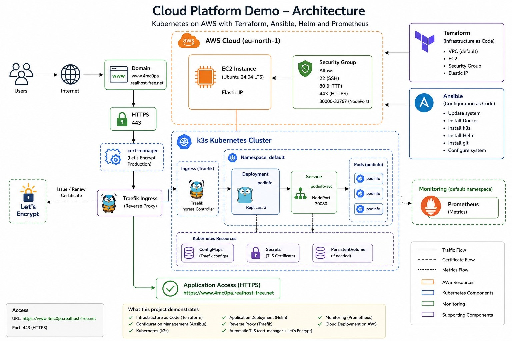
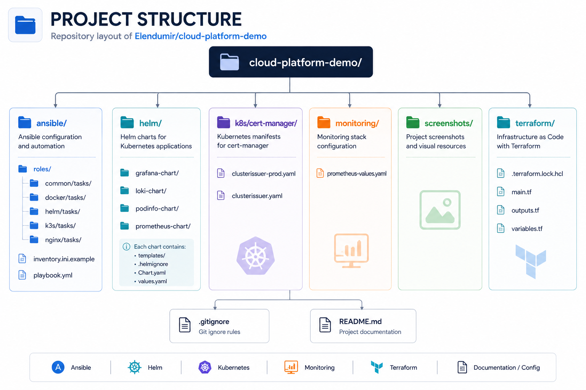
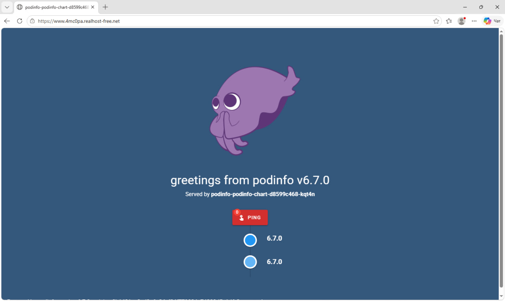
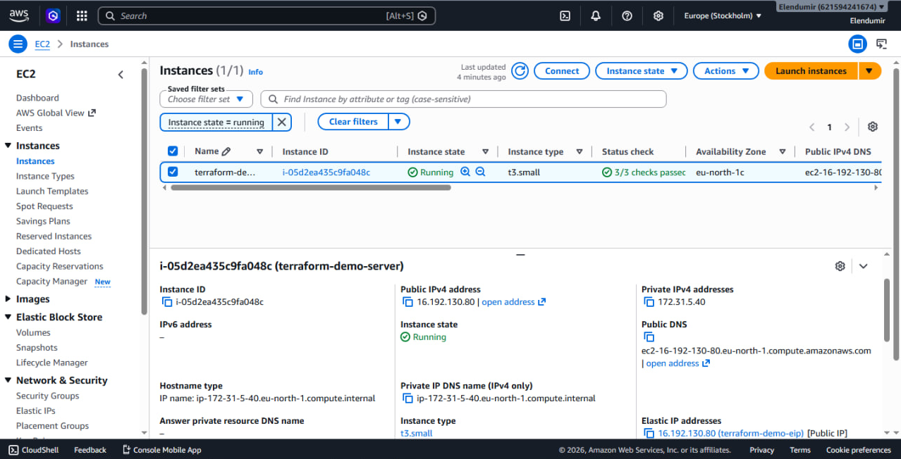
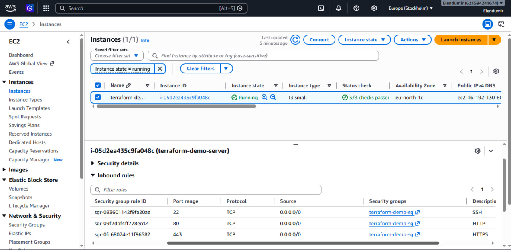
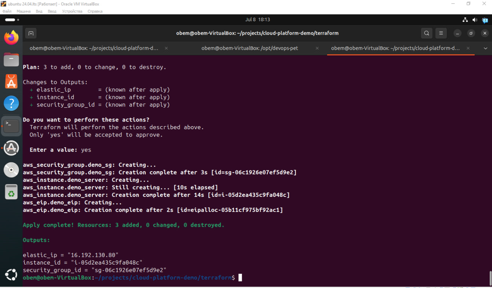
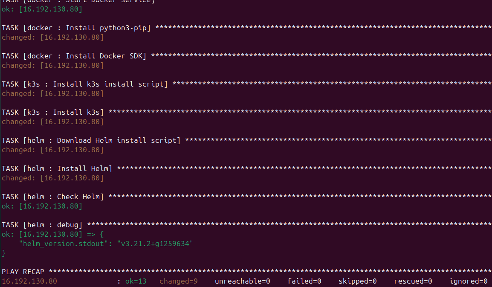
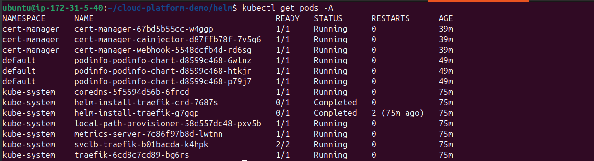
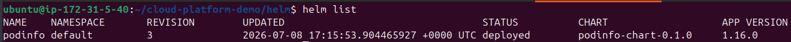
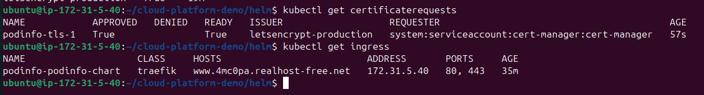

## Cloud Platform Demo

  This projects is about demonstration of deploying a containerzed application to Kubernetes on AWS using IaC.
The infrastructure is provisioned with Terraform, configured with Ansible and the app is deployed using Helm with automatic HHTPS provided
by cert-manager and Let's Encrypt. Also it deployed with own domain name.

## Live

https://www.4mc0pa.realhost-free.net

## Architecture


   
## Technology Stack

**AWS EC2**

**Terraform**
- Elastic Ip
- Security Groups

**Ansible**

**Docker**

**Kubernetes (k3s)**
- Helm
- Treafik
- Cert-manager
- Let's Encrypt

**Prometheus**

**GitHub**

## Project Structure




## Deployment Steps 

## Terraform
 
```bash
terraform init
terraform plan
terraform apply
```
## Ansible

```bash
ansible-playbook -i inventory.ini playbook.yml
```
## GitHub

```bash
git clone https://Elendumir/cloud-platform-demo
```
## Helm install

```bash
cd cloud-platform-demo/helm
helm install podinfo ./podinfo-chart
```

## HTTPS ready

```bash 
helm repo add jetstack https://charts.jetstack.io
helm repo update

helm install cert-manager jetstack/cert-manager \
  --namespace cert-manager \
  --create-namespace \
  --set crds.enabled=true
```
* Kubernetes

```bash
kubectl apply -f k8s/cert-manager/clusterissuer-prod.yaml

helm upgrade podinfo ./podinfo-chart
```

## Destroy

```bash
terraform destroy
```
## Features

✅ Infrastructure as Code

✅ Configuration Management

✅ Kubernetes Deployment

✅ Helm Chart

✅ HTTPS

✅ Automatic TLS

✅ Monitoring

✅ AWS Deployment

## Trobleshooting Experience

Problems encounteres
* DiskPressure
(I swamp more space for disk)

* Evicted Pods
(There were a lot of pods for helm monitoring chatrs but for k3s it was to heavy, so k3s evicted pods. I switch down some of them to stabilized k3s processing)

* GitHub Authentication 
(I generated a new Personal Access Token)

* Security Groups
(Opened ports 80 and 443)

* NodePort access
(Updated AWS Security Group)

* Kubetnetes debugging
(I used kubectl describe and kubectl logs to find out mistakes)

* Low RAM on EC2
 (Optimized helm charts and increased swap)

  
## Screenshots 

- Podinfo with HTTPS


- AWS instance (Elastic IP, region)


- AWS security group


- Terraform after apply 


- Ansible after ansible-playbook


- Kubernetes pods


- Helm list


- Ingress and certificate



## Results

As a result i deployed Podinfo app on AWS resources using IaC and automatization like Helm charts. Added monitoring charts but due to resource limints did not connect it. App has network access, domain name, HHTPS, etc. The goal was to learn how to use IaC, Helm charts using AWS resources. 
